# Richel Bilderbeek's performances

Richel Bilderbeek regularily performs 
his [music](https://github.com/richelbilderbeek/music)
on stage, at open stages or when people book me (for one meter of beer). 
For booking him, send him an email to 
[his email](http://richelbilderbeek.nl/Email.png). 
All he needs is a piano and a microphone.

## Future performances

 * None planned yet

## Past performances

Most recent at the top.

### 2018-03-16 20:00: Open Stage, [Bij Vrijdag](https://www.bijvrijdag.nl), Groningen

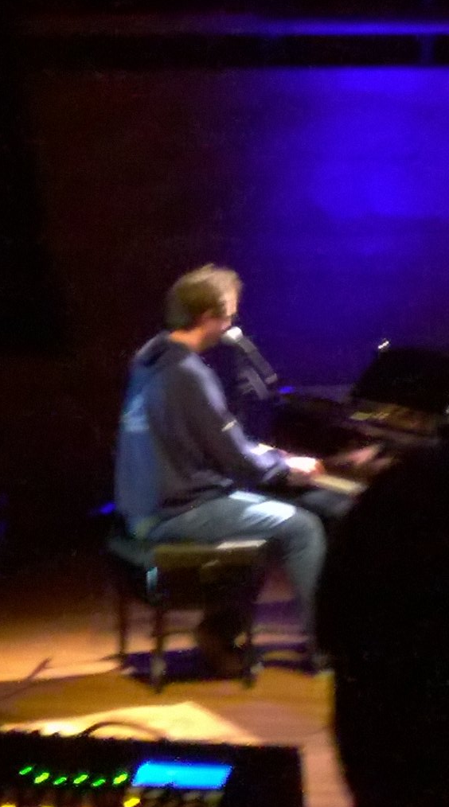

A ten-minute-max performance. I played:

 * [Vrouwen Van Je Dromen](https://github.com/richelbilderbeek/music/VrouwenVanJeDromen.md)
 * [17666216 Kleuren](https://github.com/richelbilderbeek/music/17666216Kleuren.md)

Upon request by the presenter, I was allowed to do a third song:

 * [Heejaa Mama](https://github.com/richelbilderbeek/music/HeejaaMama.md)

### 2014-03-30 15:00: Open Podium, [Prinsentheater](http://www.prinsentheater.nl/), Groningen

...

### 2014-03-20 19:00: Open Podium, [GLV Idun](http://www.glv-idun.nl/), Groningen

 * [Het Leven Is Naar](https://github.com/richelbilderbeek/music/HetLevenIsNaar.md)
 * [Het Koffielied](https://github.com/richelbilderbeek/music/HetKoffielied.md)
 * [Organellenwals](https://github.com/richelbilderbeek/music/Organellenwals.md)
 * [Het N..kmenslied](https://github.com/richelbilderbeek/music/HetNeukmenslied.md)

### 2013-09-22 15:00: Open Podium, [Prinsentheater](http://www.prinsentheater.nl/), Groningen

 * [Hee Ga Je Mee](https://github.com/richelbilderbeek/music/HeeGaJeMee.md)
 * [Vrouwen Van Je Dromen](https://github.com/richelbilderbeek/music/VrouwenVanJeDromen.md)
 * [Heejaa Mama](https://github.com/richelbilderbeek/music/HeejaaMama.md)
 * [Wooloo Mooloo](https://github.com/richelbilderbeek/music/WoolooMooloo.md)

### 2011-03-13: Open Podium, [Prinsentheater](http://www.prinsentheater.nl/), Groningen

 * [Voor De Klas](https://github.com/richelbilderbeek/music/VoorDeKlas.md)
 * [Heejaa Mama](https://github.com/richelbilderbeek/music/HeejaaMama.md)
 * [Morgenvroeg](https://github.com/richelbilderbeek/music/Morgenvroeg.md)
 * Ode Aan De Liefde, a poem
 * [Wooloo Mooloo](https://github.com/richelbilderbeek/music/WoolooMooloo.md)

### 2011-02-17: KIEZEL week, [ASV Dionysos](http://www.asvdionysos.nl/) (former: ASV Hendrik), Groningen

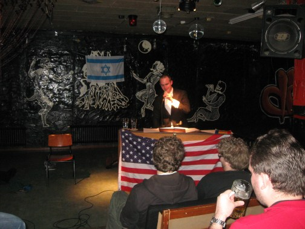
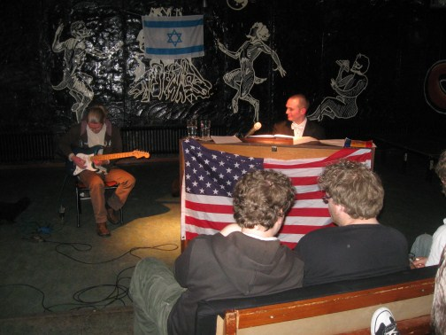

In this performance, I played one song together with Michel Hageman.

 * [Het Leven Is Naar](https://github.com/richelbilderbeek/music/HetLevenIsNaar.md)
 * [Vroeger](https://github.com/richelbilderbeek/music/Vroeger.md)
 * [Ben Ik Een Spin](https://github.com/richelbilderbeek/music/BenIkEenSpin.md)
 * [Achter Mijn Raam](https://github.com/richelbilderbeek/music/AchterMijnRaam.md)
 * [Voor De Klas](https://github.com/richelbilderbeek/music/VoorDeKlas.md)
 * Duizend Bier (instrumental song, together with Michel Mageman)
 * [Morgenvroeg](https://github.com/richelbilderbeek/music/Morgenvroeg.md)
 * [Heejaa Mama](https://github.com/richelbilderbeek/music/HeejaaMama.md)
 * [Mijn Date Van Vrijdagavond](https://github.com/richelbilderbeek/music/MijnDateVanVrijdagavond.md)
 * [You And Me](https://github.com/richelbilderbeek/music/YouAndMe.md)
 * [Wooloo Mooloo](https://github.com/richelbilderbeek/music/WoolooMooloo.md)

### 2009-08-14: KEI week, [ASV Dionysos](http://www.asvdionysos.nl/) (former: ASV Hendrik), Groningen

...

### 2008-05-15: Open Stage GLV Idun, Groningen

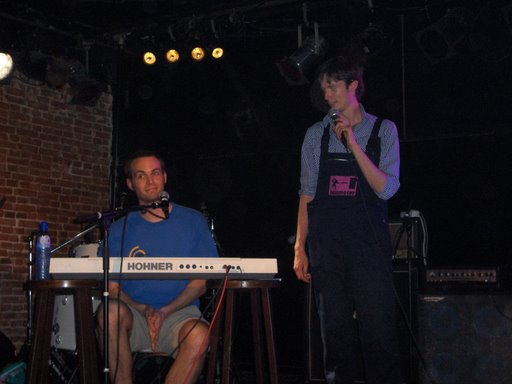
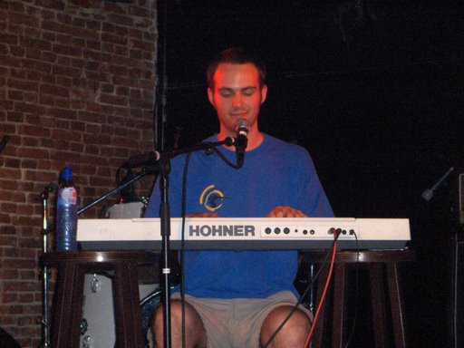

### 2007-12-09: Open Podium, [Prinsentheater](http://www.prinsentheater.nl/), Groningen

...

### 2007-02-22: Open Stage GLV Idun, Groningen

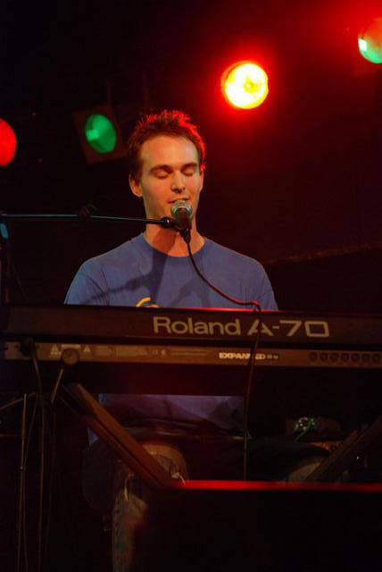 
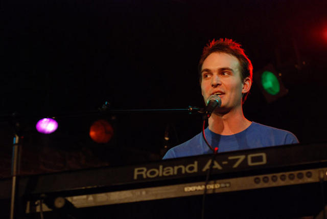
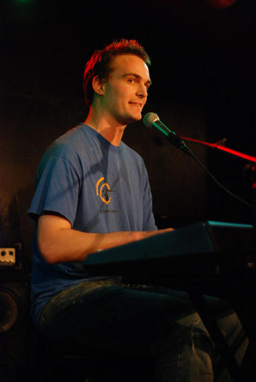
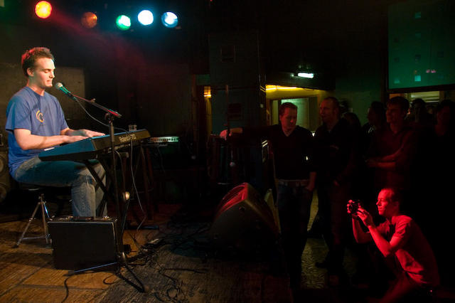
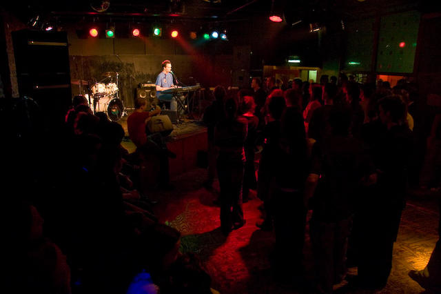
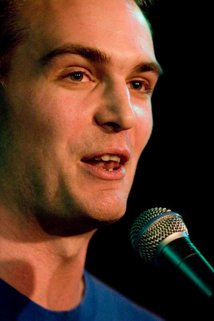
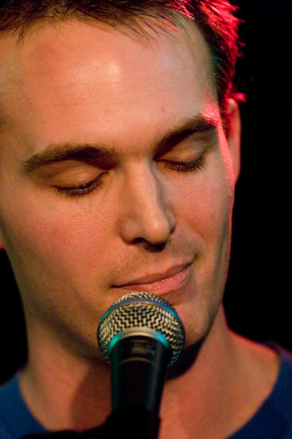
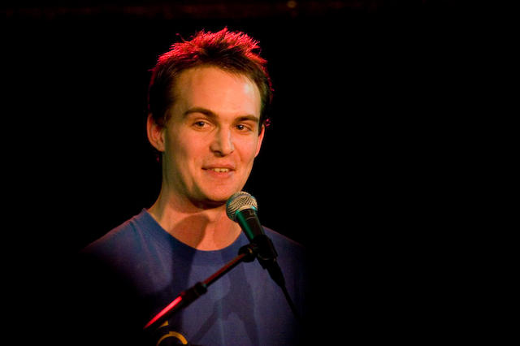

### 2006-02-05: Open Podium, [Prinsentheater](http://www.prinsentheater.nl/), Groningen

...

### 2004-08-24: KEI week, [ASV Dionysos](http://www.asvdionysos.nl/) (former: ASV Hendrik), Groningen

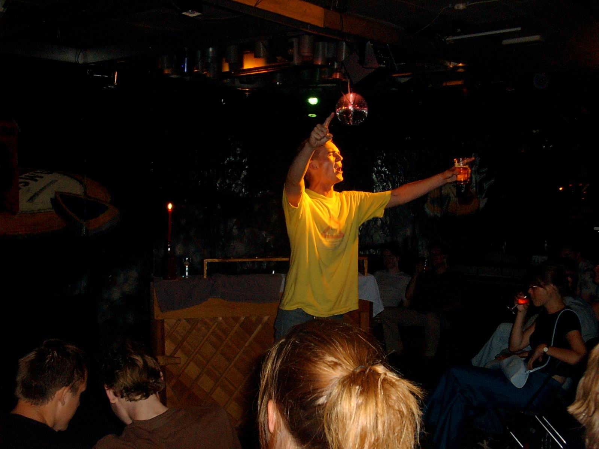

### 2004-05-25: [OntPopJe](http://www.glv-idun.nl/) (former BioPop), Platform Theater, Groningen

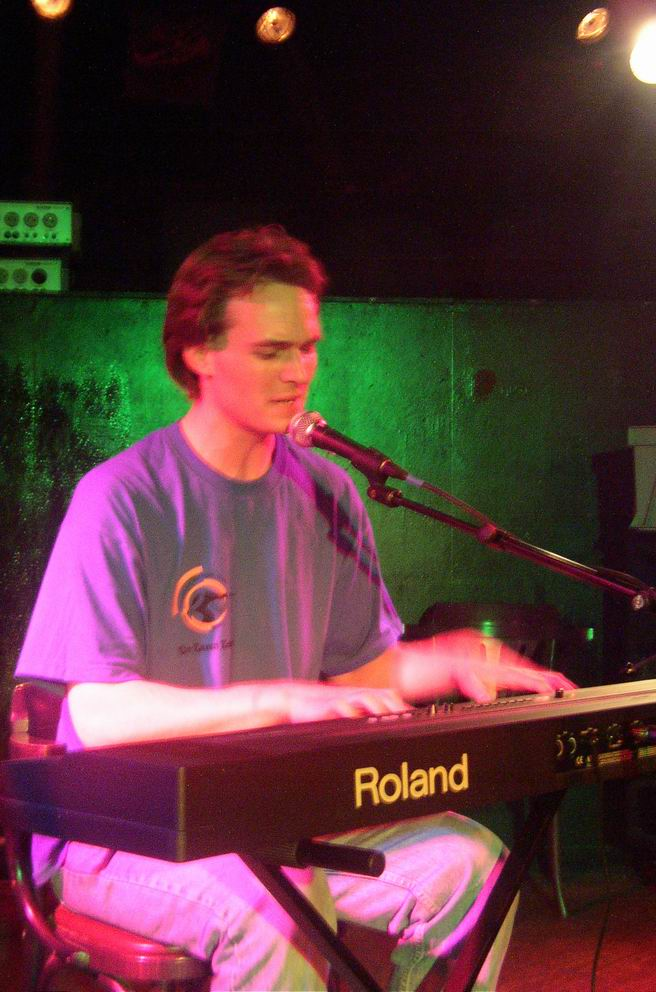
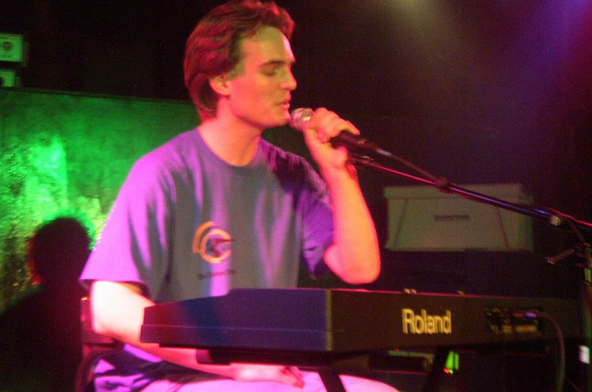 
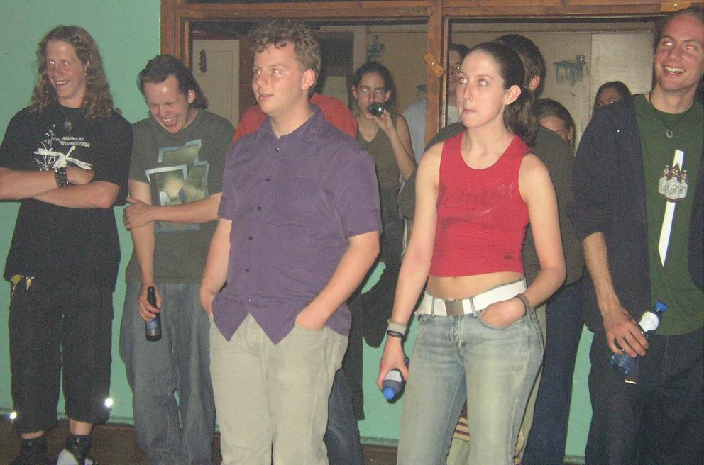)

### 2004-04-14: Kleinkunstfestival [ASV Dionysos](http://www.asvdionysos.nl/): 

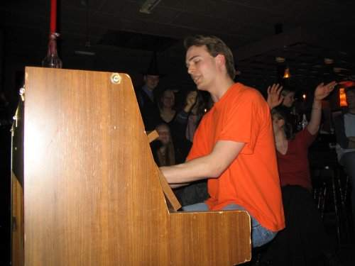
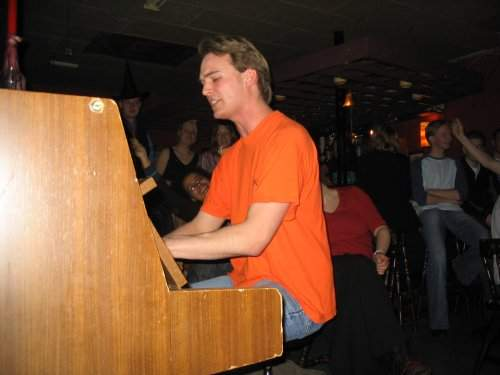

### 2003-12-07: Open Podium, [Prinsentheater](http://www.prinsentheater.nl/), Groningen

...

### 2003-12-05: Vrijdagavondsalon, [Prinsentheater](http://www.prinsentheater.nl/), Groningen

...

### 2003-07-08: as Jasper Janson's guest, De Spieghel, Groningen

...

### 2003-08-19: KEI week, [ASV Dionysos](http://www.asvdionysos.nl/) (former: ASV Hendrik), Groningen

...

### 2003-03-02: Open Podium, [Prinsentheater](http://www.prinsentheater.nl/), Groningen

...

### 2002-08-20: KEI week, [ASV Dionysos](http://www.asvdionysos.nl/) (former: ASV Hendrik), Groningen

My first solo performance.

### 2001-12-02: Open Podium, [Prinsentheater](http://www.prinsentheater.nl/), Groningen

My second performance with The Quartet.

### 2000-09-21: [OntPopJe](http://www.glv-idun.nl/) (former BioPop), Platform Theater, Groningen, with the Bilderbeek, Bilderbeek and Bogaart Bogaart Quartet

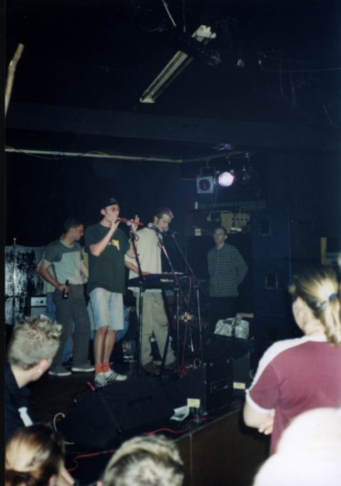

My first performance with The Quartet.
